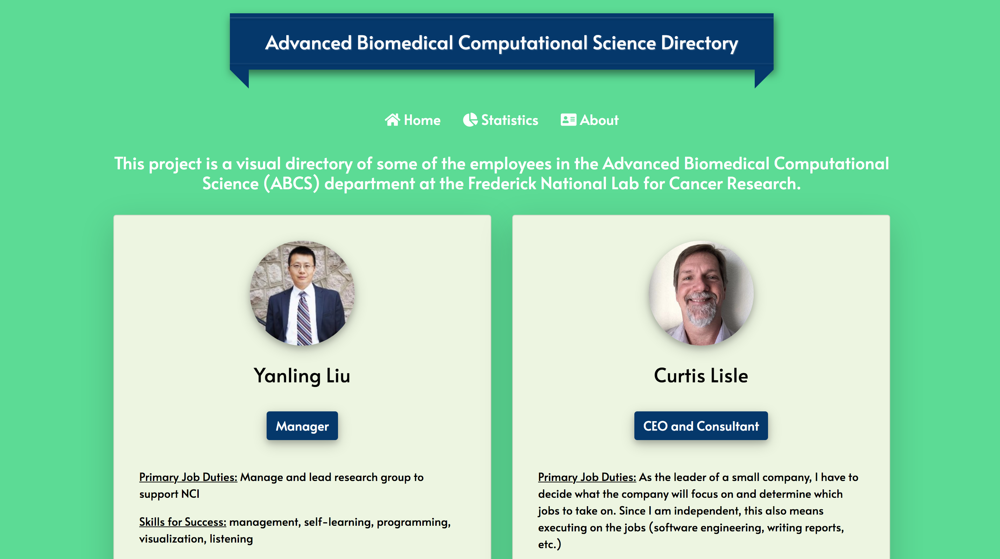

# ABCS Directory
🔬 Directory of the Advanced Biomedical Computational Science at the Frederick National Lab for Cancer Research.

## Motivation
I was tasked with an intern project to interview the employees around my internship and talk to them about their educational background, favorite and least parts of the job, and more. Overall, I was able to talk with upwards of 10+ employees, all of whom exuded a fiery passion about their job.

After collecting all of my data, the next challenge was to present the information I had gathered. Unfortunately, I couldn't do a regular old Google Doc or PowerPoint. So, with some free time on my hands, I decided to scrap together a little web app to showcase my findings.

## Description
The ABCS Directory is a visual representation of the employees at the Advanced Biomedical Computational Science Department at the Frederick National Lab for Cancer Research. With this being my first time using Vue.js, I was able to create an "employee wall" of all of the individuals I was fortunate enough to interview as well as pie and bar graphs showing breakdowns by degree, skills, and title.

## Technology Used
The following libraries were used to help create SAT Question a Day:
1. Vue.js
  - Used to help display the dynamic content.
2. Tabletop.js
  - Used to help stream data from a Google Sheet, allowing me to not have to use a complicated database.
3. Chart.js
  - Used to help process the data based on degree, skills, and title and showcase the information in a beautiful and visual manner.
  
## Checklist
- [X] Create fancy banner
- [X] Create two columns for employees
- [X] Add pie graph for job title
